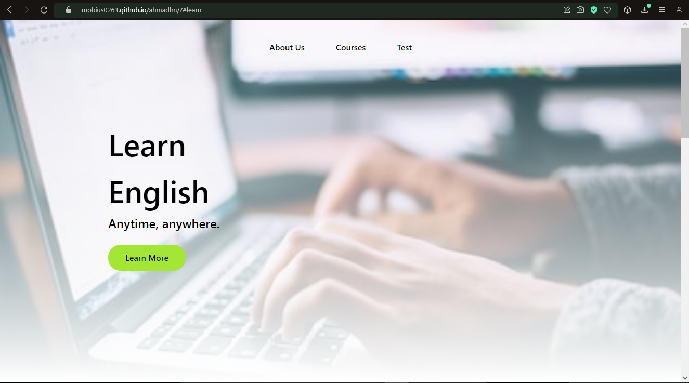

# ahmadlm
Website Kursus Bahasa

Website responsive simple tentang studi kasus kursus bahasa.

Menggunakan CSS External/Internal, Tailwind External/Internal, dan Javascript External/Internal.



- Jika tombol "Learn More" di click, akan langsung pindah ke bagian tengah website.
```html
<form method="get" action="#example">
   <button type="submit"></button>
</form>
<div id="example"></div>
```

- Jika link "Test" di click, akan memunculkan fungsi aritmatika perkalian di dalam 'alert'.
```js
function test() {
    a = prompt('first number');
    b = prompt('second number');
    alert( a + '+' + b + '=' + (parseInt(a)+parseInt(b)));
}
```

- Jika link "Courses" di click, akan memunculkan gambar kamus bahasa Inggris yang bisa disembunyikan lagi jika gambar di click.
```js
function course() {
    document.getElementById('image').style.display="block";
    document.getElementById('courseclick').style.display="none";
}
function hide() {
    document.getElementById('image').style.display="none";
    document.getElementById('courseclick').style.display="block";
}
```
